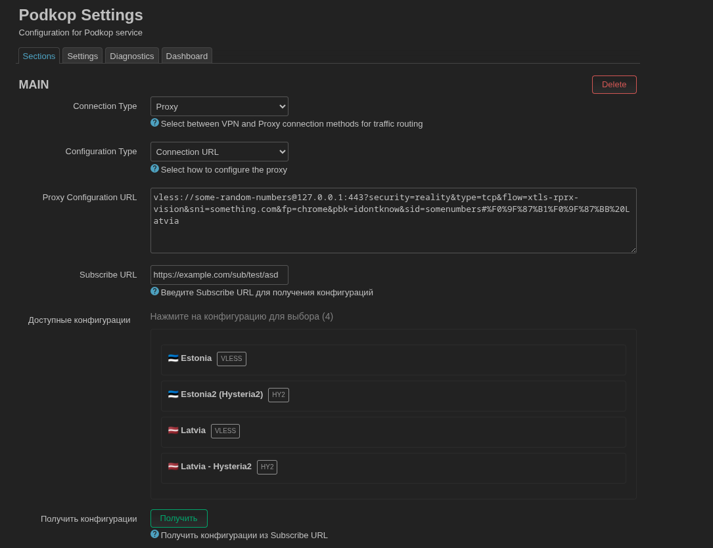

# luci-podkop-subscribe



Расширение LuCI для Podkop, добавляющее поддержку `Subscribe URL` для получения и выбора прокси-конфигураций.

Поддерживаемые протоколы: `VLESS`, `Shadowsocks (SS)`, `Trojan`, `Hysteria2 (hy2)`.

## Быстрая установка

```bash
sh <(wget -O - https://raw.githubusercontent.com/artemscine/luci-podkop-subscribe/main/install.sh)
```

## Проверенные версии

- `Podkop`: `0.7.14`
- `OpenWrt`: `24.10`, `25.12`

## Удаление

```bash
sh <(wget -O - https://raw.githubusercontent.com/artemscine/luci-podkop-subscribe/main/uninstall.sh)
```

## Возможности

- Добавляет поле `Subscribe URL` в разделы Podkop с типами `Connection URL`, `Selector` и `URLTest`
- Получает список конфигураций из subscribe-ссылки
- Позволяет выбрать одну конфигурацию для `Connection URL`
- Позволяет выбрать несколько конфигураций для `Selector` и `URLTest`
- Сохраняет введённый subscribe URL в конфигурации Podkop

## Как использовать

1. Откройте `LuCI -> Services -> Podkop`
2. Выберите `Connection Type = Proxy`
3. Выберите один из режимов:
   `Configuration Type = Connection URL`
   `Configuration Type = Selector`
   `Configuration Type = URLTest`
4. Введите `Subscribe URL`
5. Нажмите `Получить`
6. Выберите одну или несколько конфигураций из списка
7. Нажмите `Save & Apply`

## Что устанавливается

- `/www/cgi-bin/podkop-subscribe`: получает и декодирует subscribe-конфигурации
- `/www/luci-static/resources/view/podkop/section.js`: patched-версия `section.js` с подключением расширения
- `/www/luci-static/resources/view/podkop/subscribe.js`: логика работы subscribe-функциональности
- `/www/luci-static/resources/view/podkop/subscribe-loader.js`: вспомогательный loader
- `/usr/share/rpcd/acl.d/luci-app-podkop-subscribe.json`: ACL для LuCI/rpcd
